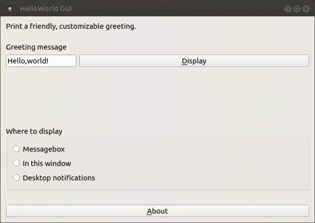

# HelloWorld GUI


[](https://travis-ci.com/enjoysoftware/helloworld-gui)
[](https://app.fossa.com/projects/git%2Bgithub.com%2Fenjoysoftware%2Fhelloworld-gui?ref=badge_shield)

Cross-platform GUI version of Hello World. This is useful for checking the operation of the GUI.
## Demo

## Snapcraft Status
[](https://build.snapcraft.io/user/enjoysoftware/helloworld-gui)
## Installation
Please install using Snapcraft.

[](https://snapcraft.io/helloworld-gui)
```
sudo snap install helloworld-gui
```
## Building
### Requirements

Qt5(Ubuntu Package: `qtbase5-dev`, `qt5-default`)  
QtTools5 Development Tools(Ubuntu Package: `qttools5-dev-tools`)
### How to build
First, execute the following command:
```bash
qmake
```
For Ubuntu and Debian, you can build by executing the "make" command as follows.

```bash
make
```


## License
[](https://app.fossa.com/projects/git%2Bgithub.com%2Fenjoysoftware%2Fhelloworld-gui?ref=badge_large)